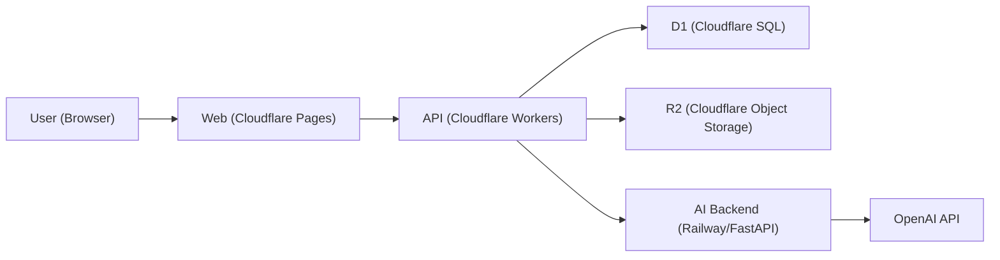

# Dageolgo

실명 기반 대학 커뮤니티 플랫폼입니다.  
Cloudflare(Edge) + Railway(AI Backend) 하이브리드 아키텍처로 운영합니다.


## Table of Contents
- [Overview](#overview)
- [Tech Stack](#tech-stack)
- [Architecture](#architecture)
- [Core API](#core-api)
- [Monorepo Structure](#monorepo-structure)
- [Quick Start](#quick-start)
- [Production Status](#production-status)
- [Documentation](#documentation)

## Overview
- 실명 기반 커뮤니티 (책임 있는 발화)
- 게시글/댓글 AI 검토
- 알림/인증/통계 API 제공
- Edge 배포 기반의 빠른 응답

## Tech Stack
### Frontend
- React
- TypeScript
- Vite
- TanStack Query
- Zustand

### Backend
- Cloudflare Workers (API Gateway)
- Cloudflare D1 (Database)
- Cloudflare R2 (Object Storage)
- FastAPI (AI Backend)
- OpenAI API (AI moderation)

### Infra
- Cloudflare Pages (Web)
- Railway (AI Backend hosting)
- GitHub Actions / GitHub-based deployment flow

## Architecture
```text
[Browser]
   |
   v
[Cloudflare Pages: apps/web]
   |
   v
[Cloudflare Workers: apps/worker-api]
   |                 \
   |                  \--> [Railway: apps/ai-backend (FastAPI + OpenAI)]
   v
[Cloudflare D1]   [Cloudflare R2]
```



핵심 포인트:
- 클라이언트는 Worker API를 단일 진입점으로 사용
- Worker는 인증/게시판/알림/통계를 처리하고 AI 백엔드와 연동
- AI 백엔드는 검토 결과를 반환하며, Worker가 최종 정책(차단/경고/강행 등록)을 적용

## Core API
| Method | Path | Description |
|---|---|---|
| `POST` | `/api/v1/auth/login` | 로그인 및 토큰 발급 |
| `POST` | `/api/v1/auth/refresh` | 액세스 토큰 갱신 |
| `GET` | `/api/v1/auth/me` | 내 프로필 조회 |
| `GET` | `/api/v1/stats/me` | 내 통계 조회 (레거시 호환) |
| `GET` | `/api/v1/notifications` | 내 알림 목록 조회 |
| `POST` | `/api/v1/posts` | 게시글 생성 (`forcePublish` 지원) |
| `POST` | `/api/v1/posts/:id/replies` | 댓글 생성 (`forcePublish` 지원) |
| `POST` | `/api/v1/ai/review` | AI 텍스트 검토 |

## Monorepo Structure
```text
apps/
  web/          # React client
  worker-api/   # Cloudflare Worker API
  ai-backend/   # FastAPI AI backend
packages/
  ...           # shared packages (if any)
infra/
  ...           # migrations / infra helpers
```

## Quick Start
```bash
npm install
npm run dev
```

서비스별 실행은 [RUN_GUIDE.md](./RUN_GUIDE.md)를 참고하세요.

## Production Status
2026-05-16 기준:
- `POST /api/v1/auth/refresh` 지원 (세션 갱신 경로 정상화)
- `GET /api/v1/notifications` 안정화
- `/api/v1/auth/me` 응답에 `id` 포함
- `/api/v1/stats/me` 레거시 경로 호환
- AI 검토 정책 강화 (욕설 + 비난/낙인성 표현)
- 경고/차단 시 `수정하기` / `그래도 올리기(forcePublish)` UX 지원

## Documentation
- 실행 가이드: [RUN_GUIDE.md](./RUN_GUIDE.md)
- 배포 가이드: [DEPLOY_GUIDE.md](./DEPLOY_GUIDE.md)
- 배포 전 체크리스트: [BEFORE_DEPLOY.md](./BEFORE_DEPLOY.md)
- 트러블슈팅: [트러블 슈팅.md](./트러블%20슈팅.md)
- 전체 설계: [DAGEOLGO_MASTER_GUIDE.md](./DAGEOLGO_MASTER_GUIDE.md)
