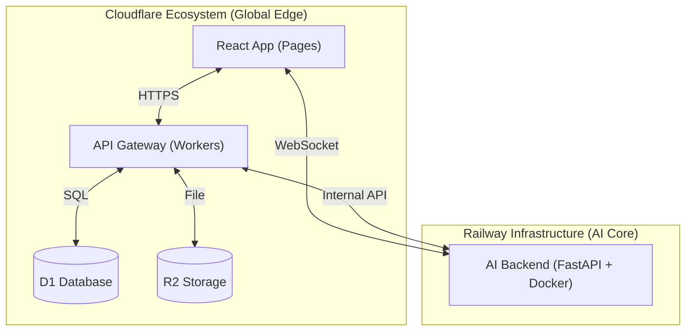

# 🎓 다걸고 (Dageolgo): 경기대학교 익명 커뮤니티 플랫폼

다걸고는 대학생들의 안전하고 따뜻한 소통을 위해 **AI 중재(Review)**와 **실시간 익명 채팅** 기술이 결합된 커뮤니티 플랫폼입니다.

---

## 🏛️ 서비스 아키텍처 (Hybrid Cloud)

본 프로젝트는 성능과 유연성을 극대화하기 위해 **Cloudflare**와 **Railway**를 혼합한 하이브리드 클라우드 아키텍처를 채택하고 있습니다.

### 시스템 다이어그램


### 레이어별 배포 전략
1.  **Frontend (`apps/web`)**: 
    - **Cloudflare Pages**를 통해 배포.
    - 글로벌 에지 네트워크를 활용한 초고속 에셋 서빙.
2.  **API Gateway (`apps/worker-api`)**: 
    - **Cloudflare Workers**를 통해 배포.
    - 지연 시간이 없는 서버리스 실행 환경 및 D1/R2 직접 바인딩.
3.  **AI Backend (`apps/ai-backend`)**: 
    - **Railway (Docker)**를 통해 배포.
    - 복잡한 Python 라이브러리(LangGraph 등) 실행을 위한 컨테이너 환경 제공.

---

## 🛠️ 기술 스택 (Tech Stack)

| 구분 | 기술 | 상세 |
| :--- | :--- | :--- |
| **Frontend** | React 18, TypeScript | Vite, Zustand, TanStack Query v5 |
| **Gateway** | Node.js (Standard) | Cloudflare Workers, D1, R2 |
| **AI Backend** | Python 3.11, FastAPI | LangGraph, Docker, Railway |
| **Database** | SQLite / D1 | Serverless SQL Database |

---

## 🚀 프로젝트 가이드 (Getting Started)

### 1. 사전 준비 (Prerequisites)
- Node.js 18+ 및 npm
- Python 3.11+
- [Wrangler CLI](https://developers.cloudflare.com/workers/wrangler/install-and-update/) (Cloudflare 개발용)
- [Railway CLI](https://docs.railway.app/guides/cli) (백엔드 배포용)

### 2. 설치 및 실행 (Step-by-Step)

#### Step 1: AI Backend 실행 (Railway 배포용)
```bash
cd apps/ai-backend
cp .env.example .env  # 환경 변수 설정
python -m venv venv
source venv/bin/activate
pip install -r requirements.txt
uvicorn app.main:app --port 8000 --reload
```

#### Step 2: Worker API 실행 (Cloudflare 배포용)
```bash
cd apps/worker-api
cp .env.example .env  # 환경 변수 설정
npm install
npm run dev  # wrangler dev
```

#### Step 3: Frontend 실행 (Cloudflare Pages 배포용)
```bash
cd apps/web
cp .env.example .env  # 환경 변수 설정
npm install
npm run dev
```

---

## 📂 개발자 인수인계 및 상세 문서

각 레이어별 상세 구현 방식과 컨벤션은 아래 문서를 참고하세요.

*   **[🎨 프론트엔드 가이드](./HANDOVER_FRONTEND.md)**: UI 컴포넌트 구조, React Query 키 전략, API 연동 규격
*   **[🤖 AI/실시간 통신 가이드](./HANDOVER_AI.md)**: LangGraph 노드 설계, Railway 배포, WebSocket 명세
*   **[📝 마스터 가이드](./DAGEOLGO_MASTER_GUIDE.md)**: 전체 서비스 정책, DB 스키마, 트러블슈팅 종합

---

## ⚠️ 배포 전 체크리스트
- Cloudflare D1/R2 바인딩 및 환경변수 설정
- Railway Dockerfile 및 환경변수 확인
- [BEFORE_DEPLOY.md](./BEFORE_DEPLOY.md) 전문 필독


